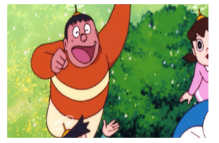
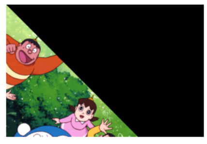

# Image-Transformation
## Aim:
To perform image transformation such as Translation, Scaling, Shearing, Reflection, Rotation and Cropping using OpenCV and Python.

## Software Required:
Anaconda - Python 3.7

## Algorithm:
### Step 1:
Import the required libraries and read the original image.

### Step 2:
Translate the image.
### Step 3:
Scale the image.

### Step 4:
Shear the image.

### Step 5:
Find reflection of image.
### Step 6:
Rotate the image.
### Step 7:
Crop the image.

### Step 8:
Display all the Transformed images.

## Program:
~~~
Developed By: Jithendra VA
Register Number:21221230043
~~~
~~~
import numpy as np
import cv2
import matplotlib.pyplot as plt
img=cv2.imread("1.jpeg")
img=cv2.cvtColor(img,cv2.COLOR_BGR2RGB)
plt.axis('off')
plt.imshow(img)
plt.show()
rows,cols,dim=img.shape
~~~
### i) Image Translation:
~~~
M=np.float32([[1,0,20],
             [0,1,50],
             [0,0,1]])
translated_img=cv2.warpPerspective(img,M,(cols,rows))
plt.axis('off')
plt.imshow(translated_img)
plt.show()
~~~
### ii) Image Scaling:
~~~
M=np.float32([[1.5,0,0],
             [0,2,0],
             [0,0,1]])
scaled_img=cv2.warpPerspective(img,M,(cols,rows))
plt.axis('off')
plt.imshow(scaled_img)
plt.show()
~~~
### iii) Image shearing:
~~~
M_x=np.float32([[1,0.2,0],
               [0,1,0],
               [0,0,1]])
M_y=np.float32([[1,0,0],
               [0.4,1,0],
               [0,0,1]])
sheared_img_xaxis=cv2.warpPerspective(img,M_x,(cols,rows))
sheared_img_yaxis=cv2.warpPerspective(img,M_y,(cols,rows))
plt.axis('off')
plt.imshow(sheared_img_xaxis)
plt.show()
plt.axis('off')
plt.imshow(sheared_img_yaxis)
plt.show()
~~~

### iv) Image Reflection:
~~~
M_x=np.float32([[1,0,0],
               [0,-1,rows],
               [0,0,1]])
M_y=np.float32([[-1,0,cols],
               [0,1,0],
               [0,0,1]])
reflected_img_xaxis=cv2.warpPerspective(img,M_x,(cols,rows))
reflected_img_yaxis=cv2.warpPerspective(img,M_y,(cols,rows))
plt.axis('off')
plt.imshow(reflected_img_xaxis)
plt.show()
plt.axis('off')
plt.imshow(reflected_img_yaxis)
plt.show()
~~~

### v) Image Rotation:
~~~
angle=np.radians(45)
M=np.float32([[np.cos(angle),-(np.sin(angle)),0],
               [np.sin(angle),np.cos(angle),0],
               [0,0,1]])
rotated_img=cv2.warpPerspective(img,M,(cols,rows))
plt.axis('off')
plt.imshow(rotated_img)
plt.show()
~~~
### vi) Image Cropping:
~~~
cropped_img=img[20:150,60:230]
plt.axis('off')
plt.imshow(cropped_img)
plt.show()
~~~
## Output:
## Original Image:

## i) Image Translation:

## ii) Image Scaling:

## iii) Image shearing:

## iv) Image Reflection:

## v) Image Rotation:

## vi) Image Cropping:

## Result: 

Thus the different image transformations such as Translation, Scaling, Shearing, Reflection, Rotation and Cropping are done using OpenCV and python programming.
